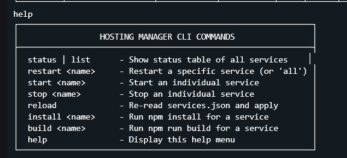

# Hosting Manager
One server, multiple apps. Run all your Node.js services under a single entry instance.

A multi-bot and service manager with a dynamic reverse proxy gateway, automatic crash recovery, live configuration watching, and interactive CLI management.



---

## Why Hosting Manager?

Many budget hosting providers, PaaS platforms, and bot panels limit deployments to a **single entry point** (`npm start`) and a **single public port**. Running multiple bots, webhooks, or dashboards traditionally requires purchasing multiple hosting plans or configuring complex Nginx/Docker setups.

**Hosting Manager enables your hosting environment to support multiple `index.js` applications simultaneously:**

- **Multiple Applications on One Instance**: Run multiple independent bots, webhooks, and APIs concurrently in isolated child processes under a single root command.
- **Single Public Port Routing**: Route incoming HTTP and WebSocket traffic (e.g., `/api`, `/dashboard`, `/bot`) to different internal services using the integrated reverse proxy gateway.
- **Process Isolation and Self-Healing**: If one service crashes, other services remain uninterrupted while the circuit breaker manages automatic retries with exponential backoff.
- **Zero-Downtime Configuration**: Add, enable, or disable services dynamically by editing `services.json`—the file watcher updates processes without restarting the host.
- **Zero Configuration Overhead**: No Nginx, Docker, or PM2 configurations needed. Place your service directories in the project root and launch.

---

## Features

- **Dynamic Reverse Proxy Gateway**: Built-in HTTP and WebSocket proxying (`http-proxy`) with route-based request dispatching to backend services.
- **Resilience and Circuit Breaking**: Automatic crash recovery with exponential backoff and circuit breaking to prevent infinite restart loops on faulty processes.
- **Hot-Reloading and File Watcher**: Automatically detects and applies updates to `services.json` at runtime without restarting the main manager process.
- **Interactive REPL Console**: Built-in CLI with live status tables and commands to start, stop, restart, install, and build individual services.
- **RESTful Management API**: Endpoints (`/_health`, `/_status`, `/_manage`) for remote monitoring, health checks, and service orchestration.
- **Automated Dependency and Build Pipeline**: Automatically triggers `npm install` / `npm ci` and `npm run build` on startup or on demand, including nested sub-projects.
- **Entry Point Resolution**: Automatically detects entry points via `package.json` (`main`), `src/index.js`, `dist/`, `bundle.cjs`, or root `index.js`.

---

## Architecture Overview

```
                          ┌───────────────────────────┐
                          │   Public Gateway (Port)   │
                          │   HTTP / WebSocket Proxy  │
                          └─────────────┬─────────────┘
                                        │
           ┌────────────────────────────┼────────────────────────────┐
           │ Routes: /api, /service-a   │ Routes: /                  │ Background / Non-routed
           ▼                            ▼                            ▼
   ┌───────────────┐            ┌───────────────┐            ┌───────────────┐
   │   Service A   │            │   Service B   │            │   Worker /    │
   │  (Port 8003)  │            │  (Port 8004)  │            │   Bot Service │
   └───────────────┘            └───────────────┘            └───────────────┘
```

---

## Getting Started

### 1. Prerequisites

- Node.js v18.0.0 or higher
- npm v9.0.0 or higher

### 2. Installation

Clone the repository and install the root gateway dependencies:

```bash
git clone https://github.com/User-425/hosting-manager.git
cd hosting-manager
npm install
```

### 3. Environment Configuration

Copy the example environment file and configure settings:

```bash
cp .env.example .env
```

Configuration variables:

```env
PORT=8000
ADMIN_SECRET=your_super_secret_admin_key
NODE_ENV=production
```

| Variable | Description | Default |
| :--- | :--- | :--- |
| `PORT` | Public port the reverse proxy gateway listens on | `25575` |
| `ADMIN_SECRET` | Secret token used to authenticate Admin API endpoints | `hosting_admin_key` |
| `NODE_ENV` | Environment mode (`production` or `development`) | `development` |
| `NTFY_ENABLED` | Enable or disable the ntfy integration | `true` |
| `NTFY_TOPIC` | Ntfy topic to listen to for incoming remote commands | - |
| `NTFY_SERVER` | Custom ntfy server URL | `https://ntfy.sh` |
| `NTFY_AUTH` | Authorization header for private ntfy topics | - |
| `NTFY_PREFIX` | Prefix required to execute a command (e.g., `!`) | `""` |

### 4. Service Configuration (`services.json`)

Create `services.json` from the provided example template:

```bash
cp services.json.example services.json
```

Example configuration:

```json
{
  "settings": {
    "publicPort": 25575,
    "restartDelayMs": 3000,
    "maxCrashCount": 5,
    "crashWindowMs": 60000,
    "autoWatchConfig": true
  },
  "services": {
    "discord-bot": {
      "enabled": true,
      "port": 8004,
      "routes": ["/"],
      "install": true,
      "build": false,
      "subProjects": [
        {
          "name": "dashboard",
          "path": "dashboard",
          "install": true,
          "build": true
        }
      ]
    },
    "ndfy": {
      "enabled": true,
      "port": 8003,
      "routes": ["/ndfy", "/ntfy"],
      "install": true,
      "build": true
    },
    "discord-assistant": {
      "enabled": true,
      "install": true,
      "build": false
    }
  }
}
```

#### Settings Schema

- `settings.publicPort` *(number)*: Default gateway port (overridden by `process.env.PORT` if set).
- `settings.restartDelayMs` *(number)*: Base delay (in milliseconds) before restarting a crashed service.
- `settings.maxCrashCount` *(number)*: Maximum allowed consecutive crashes before triggering circuit breaker.
- `settings.crashWindowMs` *(number)*: Window (in ms) after which crash counters reset for stable services.
- `settings.autoWatchConfig` *(boolean)*: Automatically reload configuration when `services.json` changes.
- `settings.ntfyEnabled` *(boolean)*: Enable or disable the ntfy listener.
- `settings.ntfyTopic` *(string)*: Topic name to listen to on the ntfy server.
- `settings.ntfyServer` *(string)*: Custom ntfy server URL (defaults to `https://ntfy.sh`).
- `settings.ntfyAuth` *(string)*: Authorization header string for private topics.
- `settings.ntfyPrefix` *(string)*: Prefix required for ntfy commands to execute.
- `settings.ntfyAliases` *(object)*: Map of custom command aliases to actual commands.

#### Service Definition Schema

- `enabled` *(boolean)*: Whether the service should be started on launch.
- `port` *(number, optional)*: Internal port assigned to the service (exposed as `PORT` env var to the child process).
- `routes` *(string[], optional)*: Path prefixes mapped by the reverse proxy to this service.
- `install` *(boolean)*: Automatically run `npm install` / `npm ci` before starting.
- `build` *(boolean)*: Automatically run `npm run build` before starting.
- `subProjects` *(array, optional)*: Nested directories requiring separate install or build steps.

---

## Running the Manager

Start the manager process:

```bash
npm start
```

---

## Interactive Console CLI

When run in an interactive terminal, the manager provides a command prompt:

| Command | Usage | Description |
| :--- | :--- | :--- |
| `status` / `list` / `ls` | `status` | Displays a table of all services, their status, PID, port, uptime, and crash count. |
| `start` | `start <service-name>` | Manually starts a service. |
| `stop` | `stop <service-name>` | Gracefully terminates a running service. |
| `restart` | `restart <service-name \| all>` | Restarts a specific service or all enabled services. |
| `reload` | `reload` | Re-reads `services.json` and synchronizes running processes immediately. |
| `install` | `install <service-name>` | Triggers dependency installation for the service and its sub-projects. |
| `build` | `build <service-name>` | Triggers `npm run build` for the service and its sub-projects. |
| `exec` / `cmd` | `exec <service-name \| .> <cmd>` | Executes a command within the service or manager directory. |
| `clear` / `cls` | `clear` | Clears the terminal console screen. |
| `help` | `help` | Displays the help menu and list of available commands. |

---

## REST Admin and Health API

The gateway exposes administrative endpoints for health monitoring and remote management.

### 1. Health Check (Public)

```http
GET /_health
```

**Response:**
```json
{
  "status": "OK",
  "timestamp": "2026-09-07T11:00:00.000Z"
}
```

### 2. Service Status (Protected)

```http
GET /_manage/status?key=YOUR_ADMIN_SECRET
```

*Alternatively, pass `x-admin-key: YOUR_ADMIN_SECRET` in request headers.*

**Response:**
```json
{
  "services": [
    {
      "name": "discord-bot",
      "status": "RUNNING",
      "pid": 12345,
      "port": 8004,
      "routes": ["/"],
      "uptimeSeconds": 3600,
      "restarts": 0
    }
  ],
  "total": 1
}
```

### 3. Service Management Actions (Protected)

```http
GET /_manage?action=<action>&service=<service-name>&key=YOUR_ADMIN_SECRET
```

Supported actions:
- `reload`: Reload configuration file `services.json`.
- `restart`: Restart the target service (`&service=<name>`).
- `start`: Start the target service (`&service=<name>`).
- `stop`: Stop the target service (`&service=<name>`).

---

## Ntfy Remote Commands Integration

Hosting Manager includes a built-in listener for [ntfy.sh](https://ntfy.sh/) (or custom self-hosted ntfy servers), allowing you to securely execute commands from your phone or any external webhook by simply sending a push notification.

### 1. Configuration

Add the following to your `.env` file:
```env
NTFY_ENABLED=true
NTFY_TOPIC=my_secret_hosting_topic
NTFY_SERVER=https://ntfy.sh
NTFY_AUTH=Bearer tk_your_access_token
NTFY_PREFIX=!
```

Alternatively, you can configure these directly in your `services.json` under `settings`:
```json
  "settings": {
    "ntfyEnabled": true,
    "ntfyTopic": "my_secret_hosting_topic",
    "ntfyServer": "https://ntfy.sh",
    "ntfyAuth": "Bearer tk_your_access_token",
    "ntfyPrefix": "!",
    "ntfyAliases": {
      "deploy": "exec my-service npm run start"
    }
  }
```

### 2. Custom Aliases & Prefixes
- **Prefixes**: For security, you can enforce a prefix (like `!`). Messages lacking the prefix will be safely ignored. Sending `!status` executes `status`.
- **Aliases**: You can map short commands to longer scripts. With the alias configured above, sending `!deploy` translates to executing `exec my-service npm run start`.

### 3. Sending Notifications via CLI
You can also use the integrated console to send push notifications outward:
```text
ntfy my_alerts Deploy completed successfully!
```

---

## Crash Handling and Circuit Breaker

- When a managed service exits unexpectedly, the manager automatically schedules a restart with exponential backoff (up to 30 seconds).
- If a service crashes more than `maxCrashCount` times within `crashWindowMs`, the service enters `SUSPENDED` status.
- A suspended service can be resumed using the `restart <service-name>` CLI command or via the Admin API.

---

## License

This project is licensed under the MIT License - see the [LICENSE](LICENSE) file for details.

